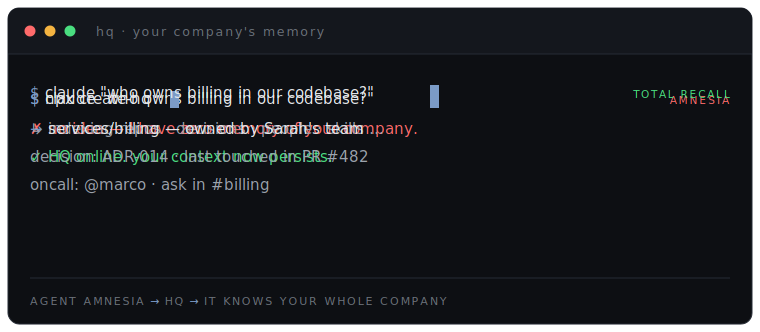

<p align="center">
  <strong>HQ</strong> — the team AI operating system
</p>

<p align="center">
  <em>Your AI agents have amnesia. HQ gives them your company's memory.</em>
</p>

<p align="center">
  
</p>

<p align="center">
  <a href="https://github.com/indigoai-us/hq-core/blob/main/LICENSE"></a>
  <a href="https://www.npmjs.com/package/create-hq"></a>
  <a href="https://docs.getindigo.ai"></a>
</p>

---

## What is HQ?

HQ is an open-source **team AI operating system** — a shared, synced context and capability
layer over **Claude Code, Cursor, and Codex**. It gives your AI coding agents your whole
company's memory — knowledge, decisions, people, skills, and policies — so they stop
forgetting everything every session.

We call that default failure **[Agent Amnesia](https://www.hqforwork.com/agent-amnesia)**:
every session, the agent knows nothing about your stack, your conventions, or the call you
made last week. You re-explain. It re-discovers. Nothing compounds. HQ is the cure.

## Quick start

```bash
npx create-hq
```

That scaffolds your HQ and wires it into the agents you already use. Prefer Homebrew?

```bash
brew install coreyepstein/tap/hq
```

## The 30-second version

1. **Agent, day one** → asks "who owns billing in our codebase?" and has *no idea*.
2. **`npx create-hq`** → HQ indexes the company: repos, decisions, people, skills.
3. **Same question, now** → "`services/billing` — Sarah's team, see ADR-014, last touched
   in PR #482." It knows your whole company.

## What's inside

- **Shared context layer** — one place for your company's knowledge, decisions, and people,
  read by your agents automatically and synced across the team.
- **Skills & workers** — reusable capabilities and specialized agents you build once and
  share, instead of re-deriving them every session.
- **Policies** — durable rules that travel with the company so every agent obeys them.
- **Packs** — rich add-ons ship as [`@indigoai-us/hq-pack-*`](https://www.npmjs.com/search?q=%40indigoai-us%2Fhq-pack)
  packages.

## Why it compounds

The more org memory accumulates in HQ, the smarter your agents get — and the higher the
cost of starting over somewhere else. The memory is both the moat and the marketing.
Read the thesis: **[Context is the moat](https://www.hqforwork.com/manifesto)**.

## Learn more

- **Docs** — https://docs.getindigo.ai
- **Agent Amnesia** (the anti-pattern HQ solves) — https://www.hqforwork.com/agent-amnesia
- **Manifesto** — https://www.hqforwork.com/manifesto

## License

[MIT](LICENSE) © Indigo AI, Inc.
